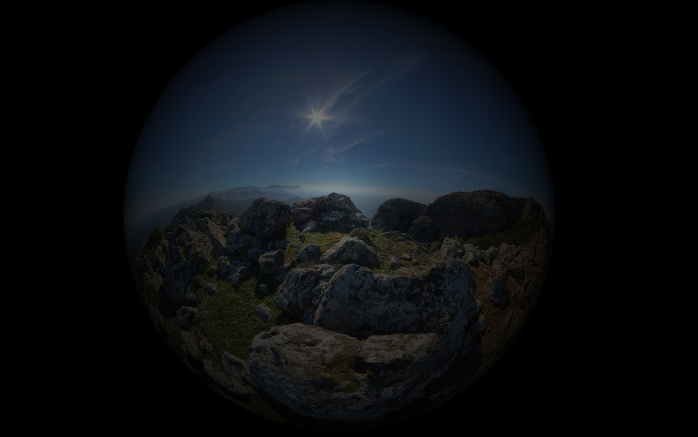
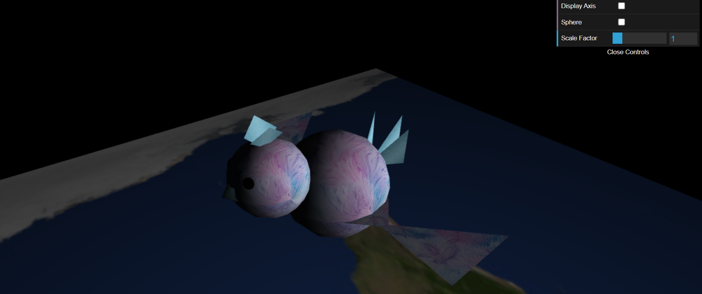
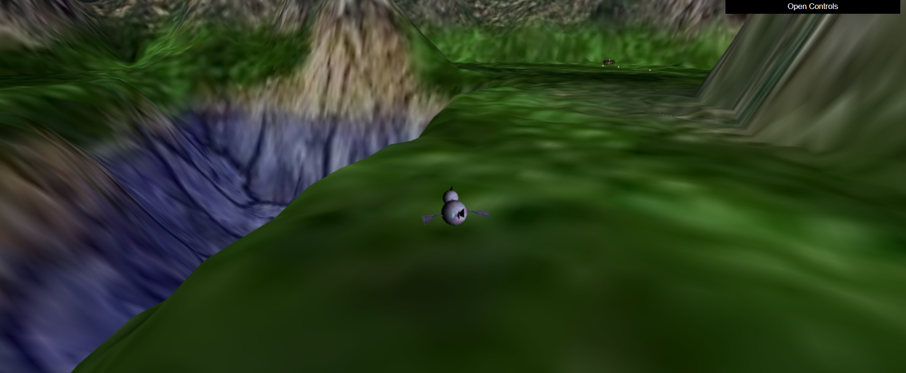
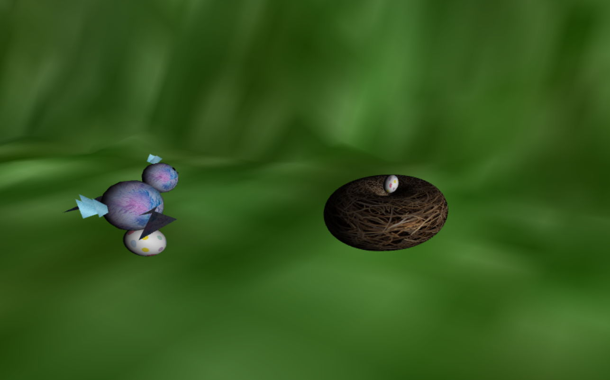
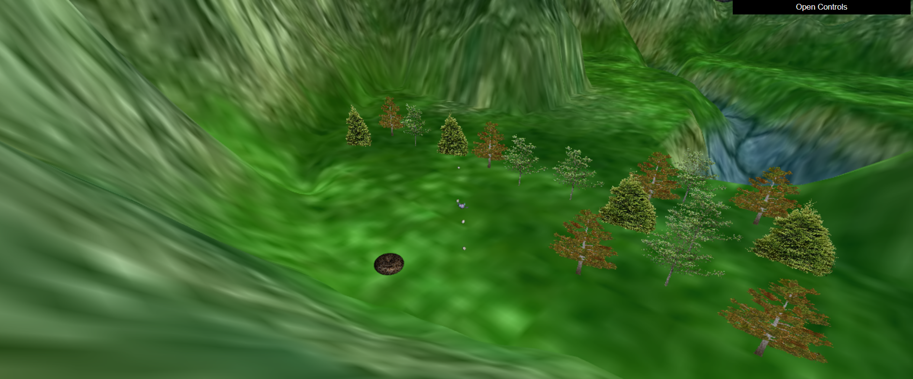

# CG 2022/2023

## Group T03G04

| Name             | Number    | E-Mail             |
| ---------------- | --------- | ------------------ |
| Mariana Azevedo  | 202005658 | up202005658@edu.fe.up.pt                |
| David Burchakov  | 202203777 | up202203777@fe.up.pt                |

## Project

## Description
The aim of this project is to create a scene that combines the different elements explored in previous
classes. For this work, you should use the code that is provided in Moodle as a base, which
corresponds to a scene with a plan of 400x400 units. You will later have to add some of the objects
created in previous works.
The scene, at the end of the project, must be generically constituted (at least) by:

- A terrain with elevations, created by a shader;
- A forest, composed of trees using billboards;
- A bird, animated and controlled by the user, as well as its nest.
- A cluster of eggs scattered across the land
The following points describe the main characteristics of the different intended elements. Some
freedom is given as to their composition in the scene, so that each group can create their own
scene.

## Set-up

* Open Project in Visual Studio Code.
Download Extension for VSC "Live Server" and click "Go Live"

https://marketplace.visualstudio.com/items?itemName=ritwickdey.LiveServer

(There are other options, any HTTP server that provides static content will do)

* Web server for Chrome: A mini web server that runs on Google Chrome itself:
https://chrome.google.com/webstore/detail/web-server-for-chrome/ofhbbkphhbklhfoeikjpcbhemlocgigb   

* Python: If Python is installed, a simple HTTP server can be created by running the following command in the folder to be shared via the web (depending on the Python version):

python -m SimpleHTTPServer 8080 (for 2.x versions)
python -m http.server 8080 (for versions 3.x).

* Node.js: https://www.npmjs.com/package/http-server 
* Other alternative servers: 

https://mongoose.ws/
http://nginx.org/en/download.html 
https://www.ritlabs.com/en/products/tinyweb/
https://caddyserver.com/download 
https://www.vercot.com/~serva/ 
https://aprelium.com/abyssws/ 

## Control

- **A, D, W, S**
To move the bird
- **P** to pick up an egg
- **O** to put the egg in the nest (have to be close to the nest)
- **H** toggle controls

## Notes
 - Tree images from: https://purepng.com/
 - Music from: https://www.chosic.com/download-audio/25463/
 - More on the project [here](Projeto-2023_en.pdf)
   
## Panorama

## Bird

## Terrain

.png)
.png)

## Nest and Eggs

## Billboard Creation

